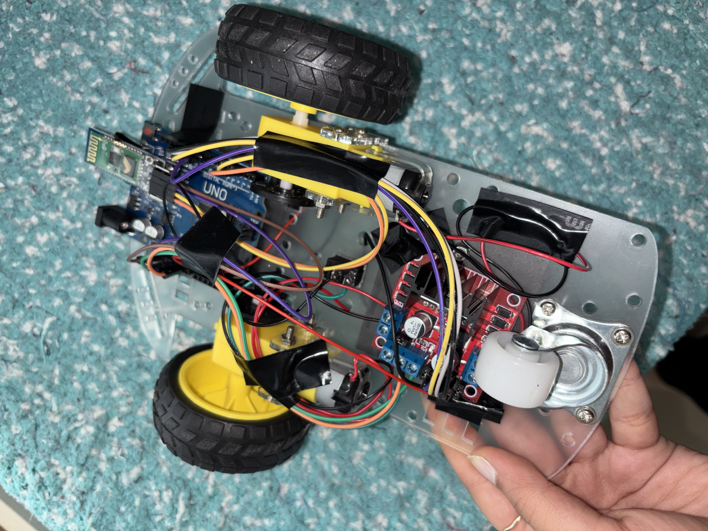

# Bluetooth Controlled RC Car

A Bluetooth-controlled 2-wheel RC car built using Arduino UNO, HC05 Bluetooth module and L298N motor driver.

## Demo

### Project Image

### Demo Video
[Watch Demo Video](demo-video.mp4)

## Overview

This project is a battery-powered Bluetooth RC car capable of forward, backward, left and right movement using a smartphone controller.

The system uses Arduino UNO for control logic, HC05 for wireless communication and L298N for motor driving.

## Components Used

- Arduino UNO
- HC05 Bluetooth Module
- L298N Motor Driver
- 2 TT DC Motors
- 8 AA Battery Pack
- Chassis and Wheels
- Power Switch

## Features

- Bluetooth-based wireless control
- Forward, backward, left and right movement
- L298N motor driver integration
- Battery-powered standalone operation
- Smartphone controller compatibility

## Wiring Overview

### HC05 Connections

- VCC → Arduino 5V
- GND → Arduino GND
- TX → Arduino Pin 2
- RX → Arduino Pin 3

### L298N Connections

- IN1 → Arduino Pin 8
- IN2 → Arduino Pin 9
- IN3 → Arduino Pin 10
- IN4 → Arduino Pin 11

## Code

The Arduino control code is included in this repository.

## Project Status

Working prototype.
